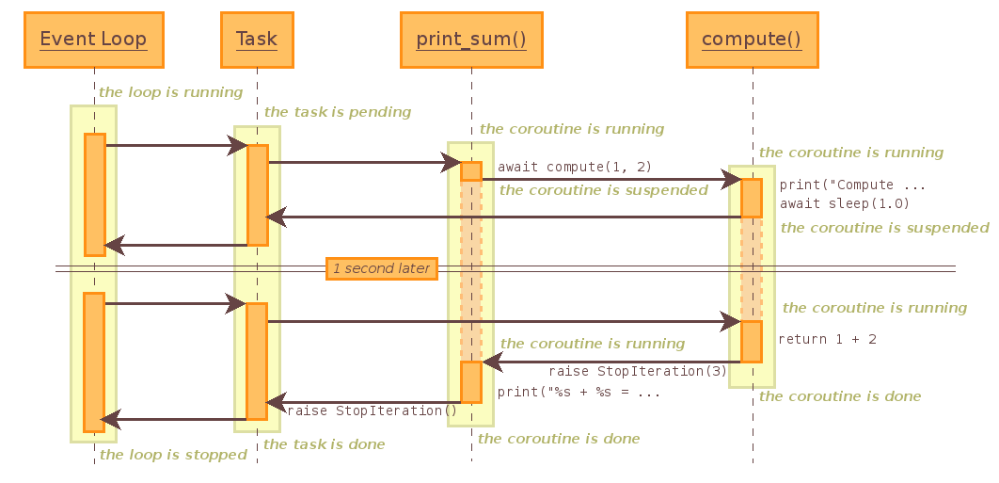

# Tasks and coroutines

源代码: [Lib/asyncio/tasks.py](https://github.com/python/cpython/tree/3.6/Lib/asyncio/tasks.py)

源代码: [Lib/asyncio/coroutines.py](https://github.com/python/cpython/tree/3.6/Lib/asyncio/coroutines.py)

## Coroutines

`asyncio`使用的协程可以通过语句`async def`来实现，或者使用生成器.`async def`类型的协程在Python3.5以后引入，如果没有向后兼容性问题的话推荐使用这种类型的协程。

生成器类型的协程必须使用`@asyncio.coroutine`来装饰。这个装饰器可以让生成器和`async def`协程相兼容。生成器类型的协程可以使用`PEP380`引入的`yield from`语法。

单词"coroutine"，和单词"generator"，用于两个完全不同的概念(虽然有些关联):

- 定义为协程的函数(使用`async def`或者`@asyncio.coroutine`).为了消除歧义，我们把它叫做协程函数（`asyncio.iscoroutinefunction()`会返回True）.
- 调用协程函数以后的对象。这个对象代表一个计算或者一个I/O操作。为了消除歧义，我们把它叫做协程对象(`asyncio.iscoroutine()`会返回True)。

一个协程可以做的事情包括:

- `result = await future`或者`result = yield from future` - 暂停协程，直到future完成，然后返回future的结果，或者抛出异常，这个异常可以向上传播(如果future被取消了，会抛出一个`CancellError`).注意task也是future，任何关于future的讨论同样适用于task。
- `result = await coroutine`或者`result = yield from coroutine` - 等待另一个协程生成结果(或者抛出异常)。`coroutine`代表调用另一个协程的表达式。
- `return expression` - 生成一个协程的结果，使用`await`或者`yield from`来等待协程执行。
- `raise exception` - 抛出一个协程的异常，使用`await`或者`yield from`来等待协程执行。

调用一个协程并不意味着直接执行它的代码 - 调用后返回的协程对象实际上什么也不会做，知道你规划执行它。有两种基本的方式可以启动一个协程：在另一个协程中调用`await coroutine`或者`yield from coroutine`（假定这个协程已经在运行了)，或者使用`ensure_future()`函数或`AbstractEventLoop.create_task()`方法规划协程的运行。

协程(以及task)只有在事件循环在运行的时候在可以运行。

- @`asyncio.coroutine`

    一个装饰器，可以将一个生成器函数标记为协程。

    如果是`async def`函数，不需要进行装饰。

    如果一个生成器在销毁之前都没有yield，会在日志中记录一个错误信息。

> 注意
>
>> 在这片文档中，很多方法都被注明为协程，即使它只是一个返回future的普通函数。如果一个函数想要用作在callback风格的代码中，需要将它的结果封装在`ensure_future()`.

### Example: Hello World coroutine

```python
import asyncio


async def hello_world():
    print("Hello World!")


loop = asyncio.get_event_loop()
loop.run_until_complete(hello_world())
loop.close()
```

### Example: Coroutine displaying the current date

```python
import asyncio
import datetime


async def display_date(loop):
    end_time = loop.time() + 5.0
    while True:
        print(datetime.datetime.now())
        if (loop.time() + 1.0) >= end_time:
            break
        await asyncio.sleep(1)


loop = asyncio.get_event_loop()
loop.run_until_complete(diplay_date(loop))
loop.close()
```

### Example: Chain coroutines

```python
import asyncio


async def compute(x, y):
    print("Compute %s + %s ..." %(x, y))
    await asyncio.sleep(1.0)
    return x + y


async def print_sum(x, y):
    result = await compute(x, y)
    print("%s + %s = %s" %(x, y, result))


loop = asyncio.get_event_loop()
loop.run_until_complete(print_sum(1, 2))
loop.close()
```

这个例子的示意图如下:



这个示意图展示了控制流，虽然并没有描述内部逻辑。例如，`asyncio.sleep()`协程使用`AbstractEventLoop.call_later()`创建了一个内部future。

## InvalidStateError

- exception`asyncio.InvalidStateError`

    当前状态不准进行该操作。

## TimeoutError

- exception`asyncio.TimeoutError`

    操作已经超出了deadline。(这个错误和内置的`TimeoutError`不同)

## Future

- class`asyncio.Future(*, loop=None)`

    这个类尽量兼容了`concurrent.futures.Future`。

    不同之处：

    - `result()`和`exception()`不能接受timeout参数，在future没有完成的时候不会抛出异常。
    - `add_done_callback()`注册的callback，总是会通过事件循环的`.call_sonn()`来调用。
    - 这个类不兼容于`concurrent.futures`中的`wait()`和`as_completed()`函数。

    - `cancel()`

        取消future和已规划的callback。

        如果future已完成或者已取消，返回`False`.否则，会修改future的状态为cancelled，然后返回`True`.

    - `cancalled()`

        如果future已经取消(cancelled)，返回`True`。

    - `done()`

        如果future已经完成(done)，返回`True`.

        done意味着future已经有了结果/异常，或者说future已经被取消了。

    - `result()`

        返回这个future代表的结果。

        如果future已经被取消了，则抛出`CancelledError`.如果future的结果还不可获取，抛出`InvalidStateError`.如果future完成不过抛出了异常，则再次抛出这个异常。

    - `exception()`

        返回这个future设置的exception。

    - `add_done_callback(fn)`

        加入一个callback，在future完成以后运行。

        这个callback以单个参数(future对象)的形式运行.如果future完成以后，这个callback使用`.call_soon()`来调用。

    - `remove_done_callback(fn)`

        在“call when done”列表中移除一个callback的所有实例。

        返回移除的callback数量。

    - `set_result(result)`

        标记这个future完成，并设置它的结果。

        如果在调用这个方法的时候这个future已经完成，抛出`InvalidStateError`

    - `set_exception(exception)`

        标记这个future完成，并设置一个exception。

        如果在调用这个方法的时候这个future已经完成，抛出`InvalidStateError`

### Example: Future with run_until_complete()

```python
import asyncio


async def slow_operation(future):
    await asyncio.sleep(1)
    future.set_result('Future is done!')


loop = asyncio.get_event_loop()
future = asyncio.Future()
asyncio.ensure_future(slow_operation(future))
loop.run_until_complete(future)
print(future.result())
loop.close()
```

这个协程函数负责计算(假定使用了1秒)然后把结果存储到future中。`run_until_complete()`方法等待future的完成。

> 注意
>
>> 在future完成的时候，`run_until_complete()`方法使用内部的`add_done_callback()`方法来通知。

### Example: Future with run_forever()

上面的例子可以使用的方式来编写，可以使用`Future.add_done_callback()`:

```python
import asyncio


async def slow_operation(future):
    await asyncio.sleep(1)
    future.set_result('Future is done!')


def got_result(future):
    print(future.result())
    loop.stop()


loop = asyncio.get_event_loop()
future = asyncio.Future()
asyncio.ensure_future(slow_operation(future))
future.add_done_callback(got_result)
try:
    loop.run_forever()
finally:
    loop.close()
```

## Task

- class`asyncio.Task(coro, *, loop=None)`

    规划一个协程的执行：将它封装到一个future中。Task是`Future`的子类。

    一个task负责一个事件循环中一个协程对象的执行。如果封装的协程来自于一个future，task会暂停执行并等待future的完成。在future完成的时候，将会使用future的结果/异常，重启封装的协程。

    事件循环使用协作式规划：一个事件循环只会在一个时间中运行一个task。如果有其它事件循环运行在另一个线程，也可以有其它的任务并行执行。在一个task等待一个future完成的时候，事件循环可以执行一个新的task。

    task的取消和future的取消有所不同。调用`.cancel()`会抛出`CancelledError`.

    如果一个待定的task已经被销毁，它封装的协程并没有完成。它可能是一个bug，将会记录一个warning。

    **不要直接创建`Task`实例**: 使用`ensure_function()`函数或者`AbstractEventLoop.create_task()`方法。

    这个类不是线程安全的。

    - classmethod`all_tasks(loop=None)`

        返回一个事件循环中所有的tasks。

        默认会返回当前事件循环的所有task。

    - classmethod`current_task(loop=None)`

        返回一个事件循环中当前运行的task，或者None。

        默认会返回当前事件循环当前运行的task。

        如果当前上下文中没有运行的`Task`，则返回`None`.

    - `cancel()`

        请求让这个task取消它自己。

    - `get_stack(*, limit=None)`

        返回这task协程当前的stack frame.

    - `print_stack(*, limit=None, file=None)`

        打印这个task协程stack或者traceback。


### Example: Parallel execution of tasks

```python
import asyncio


async def factorial(name, number):
    f = 1
    for i in range(2, number+1):
        print("Task %s: Compute factorial(%s)..." %(name, i))
        await asyncio.sleep(1)
        f *= i
    print("Task %s: factorial(%s) = %s" %(name, number, f))


loop = asyncio.get_event_loop()
loop.run_until_complete(
    asyncio.gather(
        factorial('A', 2),
        factorial('B', 3),
        factorial('C', 4)
    )
)
loop.close()
```

输出:

```shell
Task A: Compute factorial(2)...
Task B: Compute factorial(2)...
Task C: Compute factorial(2)...
Task A: factorial(2) = 2
Task B: Compute factorial(3)...
Task C: Compute factorial(3)...
Task B: factorial(3) = 6
Task C: Compute factorial(4)...
Task C: factorial(4) = 24
```

## Task functions

> 注意
>
>> 在下面的函数中，可选参数loop可以允许传入一个事件循环，如果没有传入这个参数，则会使用默认的事件循环。

- `asyncio.as_completed(fs, *, loop=None, timeout=None)`

    返回一个迭代器。

    如果在所有Future完成之前超时，抛出`asyncio.TimeoutError`.

    ```python
    for f in as_completed(fs):
        result = yield from f
    ```

- `asyncio.ensure_future(coro_or_future, *, loop=None)`

    规划一个协程对象(coroutine object)的执行：将它封装为一个future。返回一个`Task`对象。

    如果参数是一个`future`，直接将它返回。

- `asyncio.async(coro_or_future, *, loop=None)`

    `ensure_future()`的旧版本，已废弃。

- `asyncio.wrap_future(future, *, loop=None)`

    将一个`concurrent.futures.Future`对象封装为一个`Future`对象。

- `asnycio.gather(*coros_or_futures, loop=None, return_exceptions=False)`

    返回一个future聚集结果。

    所有的future必须使用相同的事件循环。

- `asyncio.iscoroutine(obj)`

    如果`obj`是一个协程，返回True。

- `asyncio.iscoroutinefunction(func)`

    如果`func`是一个协程函数则返回True。

- `asyncio.run_coroutine_threadsafe(coro, loop)`

    将一个协程对象提交给指定的事件循环。

    返回一个`concurrent.futures.Future`对象来访问结果。

    这个函数可以在不同的线程中调用。用法：

    ```python
    # 创建一个协程
    coro = asyncio.sleep(1, result=3)
    # 将协程交给一个指定的事件循环
    future = asyncio.run_coroutine_threadsafe(coro, loop)
    # 等待future的结果，并且带一个timeout参数
    assert future.result(timeout) == 3
    ```

    如果协程抛出一个异常，将会由返回的future通知。可以在事件循环中取消这个task：

    ```python
    try:
        result = future.result(timeout)
    except asyncio.TimeoutError:
        print("The coroutine took too long, cancelling the task...")
        future.cancel()
    except Exception as exc:
        print("The coroutine raised and exception: {!r}".format(exc))
    else:
        print("The coroutine returned: {!r}".format(result))
    ```

    > 注意
    >
    >> 和其它函数不一样，`run_coroutine_threadsafe()`要求明确传入`loop`参数.

- 协程`asyncio.sleep(delay, result=None, *, loop=None)`

    创建一个协程，在给定的时间(单位：秒)后完成。如果提供了`result`，在协程完成的时候会将结果返回给调用者。

- `asyncio.shield(arg, *, loop=None)`

    等待一个future，如果已经取消会避免错误。

    语句:

    `res = yield from shield(something())`

    等同于:

    `res = yield from something()`

    不过，如果`something()`被其它代码取消，`shiled()`仍然会报错。

    如果你想要完全的避免cancellation(不推荐)，你可以组合使用`shield()`和`try/except`字句:

    ```python
    try:
        res = yield from shield(something())
    except CancelledError:
        res = None
    ```

- 协程`asyncio.wait(futures, *, loop=None, timeout=None, return_when=ALL_COMPLETED)`

    等待给定的一组futures完成。返回两组`Future`: (done, pending).

    `futures`序列参数不能为空。

    *timeout*可以用来控制运行时长。如果没有指定这个参数或者指定为`None`，即没有限制等待的时间。

    *return_when*以为着可以指定函数应该在合适返回。它必须是`concurrent.futures`模块的以下常量之一：

    常量 | 描述
    -- | --
    FIRST_COMPLETED | 在任意一个future完成或取消时，函数返回。
    FIRST_EXCEPTION | 在碰到首个抛出异常的future时，函数返回。
    ALL_COMPLETED | 在所有futures完成或取消后，函数返回。

    用法:

    `done, pending = await asyncio.wait(fs)`

- 协程`asyncio.wait_for(fut, timeout, *, loop=None)`

    等待一个Future或协程对象完成(在timeout之内)。如果`timeout`为None,则会等待future完成。

    协程将会封装为一个`Task`.

    返回Future或协程的结果。在一个timeout出现后，它会取消这个task并抛出`asyncio.TimeoutError`.想要避免task取消，可以使用`shield()`封装它。

    用法：

    `result = yield from asyncio.wait_for(fut, 60.0)`

    


